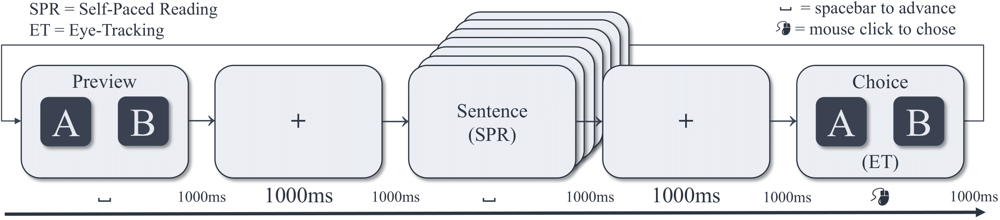
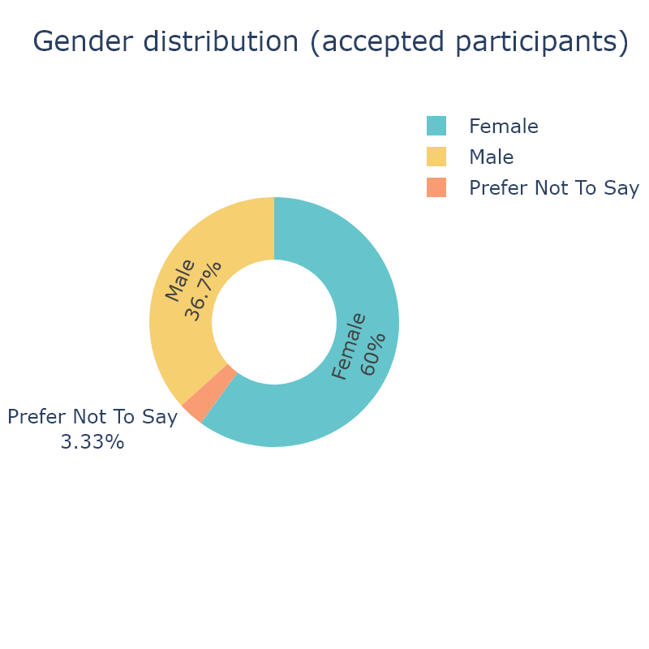
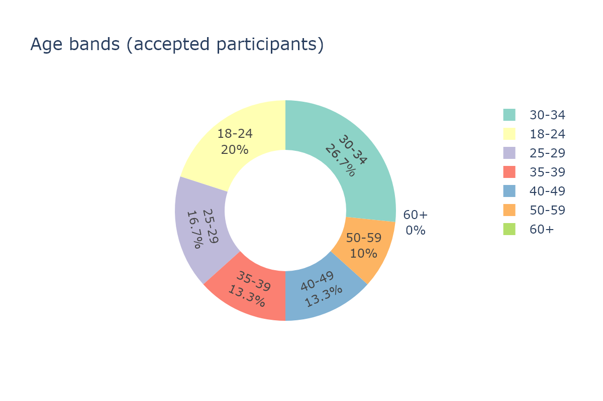
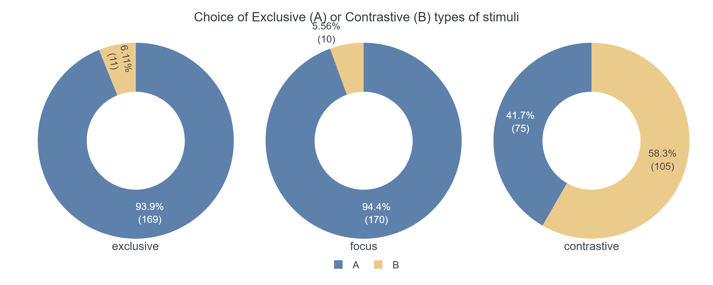
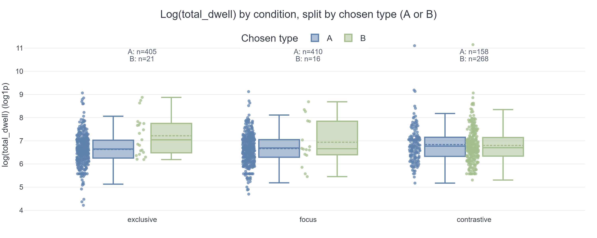
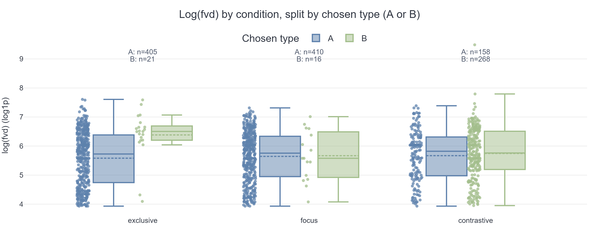
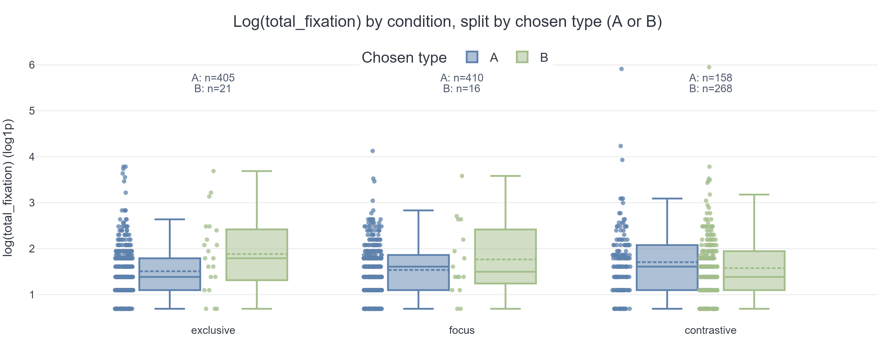
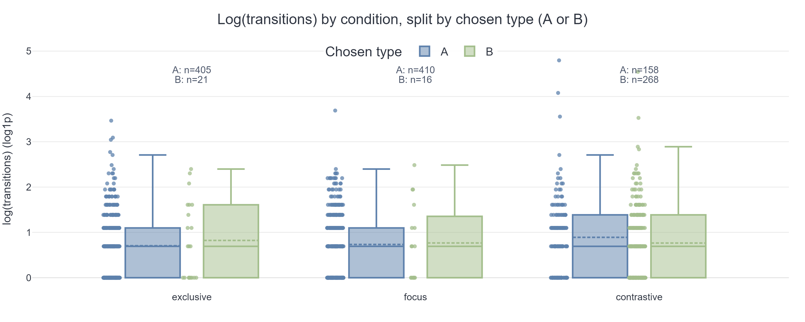

# Hungarian Focus Constructions: Exhaustivity and Contrastivity

## Project Overview

This repository contains the pipeline for a psycholinguistic experiment, from stimulus creation through data collection, processing, and statistical analysis.

## Stimuli and Experiment Setup

- **Stimulus definitions**: The master stimulus table lives in `experiment.xlsx`.
- **Stimulus preparation notebook**: `experiment_data_preparation.ipynb` reads `experiment.xlsx`, cleans and reshapes the tables, and exports task-ready CSV files for PCIbex.
- **Stimulus CSV for PCIbex**: The main experimental items are written to `chunk_includes/experiment_data.csv`, while practice items are written to `chunk_includes/practice.csv`.
- **PCIbex experiment code**: The core JavaScript for the experiment lives in `data_includes/` (e.g., `data_includes/main.js`), which loads the stimulus CSVs from `chunk_includes/`.

Here is an overview of the experiment design:

You can inspect the final stimulus set by opening the exported CSVs. For quick browsing in a browser you can, for example, use a CSV viewer extension or load `chunk_includes/experiment_data.csv` to some spreadsheet tool (Excel).

## Data Collection

- **PCIbex logs**: After running the experiment on PCIbex, raw response logs are downloaded as `results_prod.csv`.
- **Eyetracking recordings**: Concurrent eyetracking data from the experiment is stored in `eyetracking_data/` as one CSV per experiment.

## Demographic Data

- **Demographic data processing notebook**: `demographics.ipynb` reads and aggregates demographic CSV files from the `demographics/` folder (multiple Prolific exports), generating summary statistics and visualizations of participant demographics.

 

## Data Processing

- **Experiment data processing notebook**: `experiment_data_processing.ipynb` reads
	- behavioral responses from `results_prod.csv`, and
	- gaze data from the files in `eyetracking_data/`,
	then merges, cleans, and reshapes them into a trial-level eyetracking dataset.
- **Processed eyetracking dataset**: The main analysis-ready table is saved as `et_data.csv`.

The choice type and dwell time visualizations below are generated within `experiment_data_processing.ipynb` as quick checks of the processed data.
- 
- 
- 
- 
- 

## Statistical Analysis

- **R analysis script**: `analysis.R` fits linear mixed-effects models and related statistics to `et_data.csv`.
- **Model output**: The key model summaries and result tables are written to `analysis_results.txt`.

## File and Folder Summary

- `experiment.xlsx`: Master spreadsheet with stimulus definitions.
- `experiment_data_preparation.ipynb`: Notebook that creates PCIbex-ready stimulus CSVs.
- `chunk_includes/`: Contains exported stimulus files for PCIbex, including `experiment_data.csv` and `practice.csv`.
- `data_includes/`: Contains the main PCIbex experiment code (e.g., `main.js`) that reads the stimuli.
- `results_prod.csv`: Raw PCIbex log file with participant responses.
- `eyetracking_data/`: Per-participant eyetracking recordings.
- `experiment_data_processing.ipynb`: Notebook that combines PCIbex logs and eyetracking into `et_data.csv`.
- `et_data.csv`: Processed, trial-level dataset for eyetracking analyses.
- `analysis.R`: R script running linear mixed-effects models and related analyses.
- `analysis_results.txt`: Text file with the main model results from `analysis.R`.

In short, the workflow is: **stimuli in `experiment.xlsx` → PCIbex-ready stimuli via `experiment_data_preparation.ipynb` → experiment runs with code in `data_includes/` and stimuli in `chunk_includes/` → behavioral logs in `results_prod.csv` + eyetracking CSVs in `eyetracking_data/` → merged/cleaned dataset `et_data.csv` via `experiment_data_processing.ipynb` → statistical models and results via `analysis.R` and `analysis_results.txt`. 
